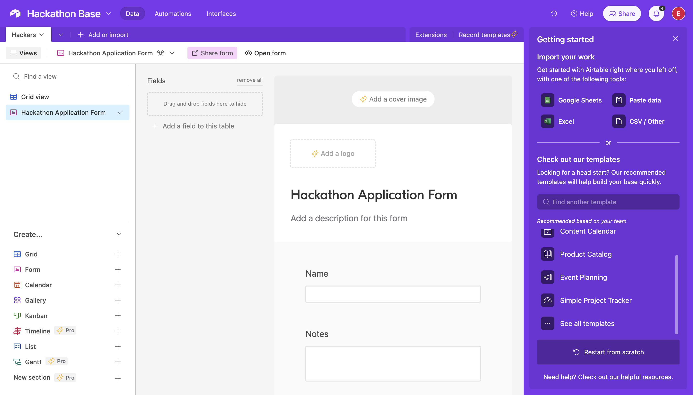
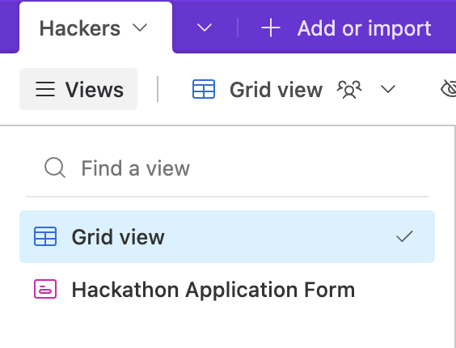
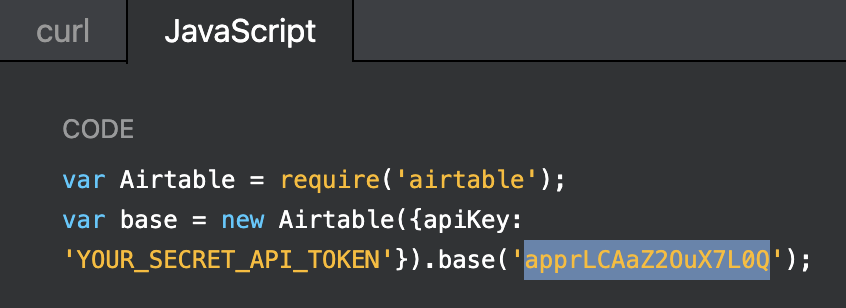
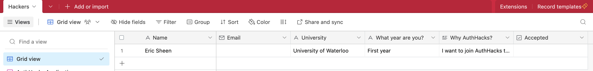
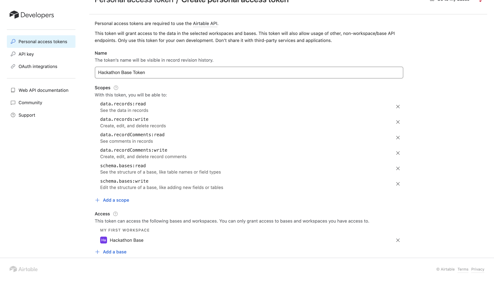
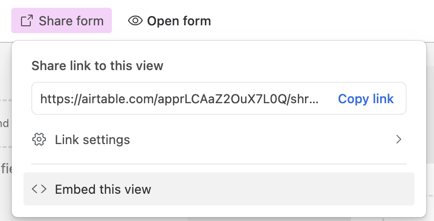
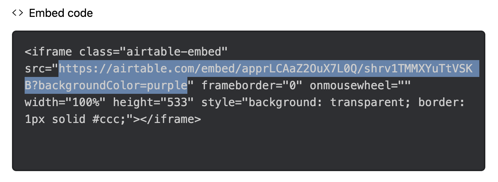

## 📦 Setting up Airtable

Example Airtable Base you can read and clone can be found [here](https://airtable.com/invite/l?inviteId=invlQvULdOyR5jxHM&inviteToken=a51154143c73da5ff94297ac0b2e2344055be7d98e39bb96d309b3f5af875bd3&utm_medium=email&utm_source=product_team&utm_content=transactional-alerts).

To build yourself, the instructions are below...

### Removing the Dummy Data

Currently, upon running the application, the information you see in your Dashboard is dummy data sent from our Airtable API route.

If you navigate to ```/app/api/airtable/route.ts``` you will notice a ```res``` variable commented out and a new ```res``` variable below it which contains the placeholder data. <br />

Once your Airtable is all setup, all you have to do is uncomment the res variable that actually gets the Airtable data and remove the current res variable which contains the dummy data. 

### Setup 

1. Sign into [Airtable](https://airtable.com/).
2. Click on the "Create a base" button on the bottom left corner of the screen.
3. In your new Untitled base you can modify the name to be something like "Hackathon Base" and the table name to be something like "Hackers." With the left navigation pane we can select to create a form! 




### Airtable Environment Variables

1. We can find our Airtable base by navigating to the [Airtable API reference](https://airtable.com/developers/web/api/introduction) and selecting the base we created. In the documentation you will discover your base. 

 

<br/>

2. Make sure that your form contains an Email field in order to populate the Airtable. Also make sure to add an Accepted (checkbox) field in your Grid View (do not reveal the checkbox in the form). Example below: 

 

<br/>

3. We can create a [personal access token](https://airtable.com/create/tokens/new) for our Airtable with the following permissions with our Hacker Base selected. 



<br />

4. Finally, we need to show our form as well! Click on the Share Form button, click on Embed this view, copy the src as highlighted, and that will be our ```AIRTABLE_FORM_EMBED``` environment variable. 




<br/>

In the example above, our environment variables would be the following:
```
AIRTABLE_PERSONAL_ACCESS_TOKEN="<YOUR_PERSONAL_ACCESS_TOKEN>"
AIRTABLE_BASE="appwwhK2wM440NySn"
AIRTABLE_TABLE_NAME="Hackers"
AIRTABLE_FORM_EMBED="<YOUR_AIRTABLE_FORM_SHARE_EMBED_LINK>"
```

<br />
<br />

## Made with ☕ + 💙

