# Next.js Hackathon Template

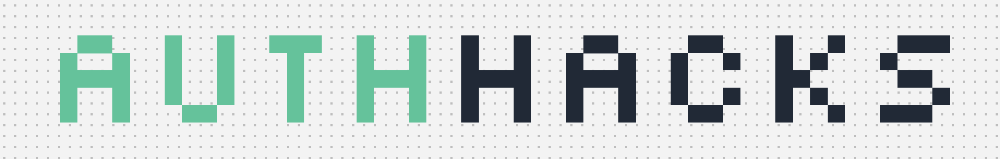

### [Template Features](#-the-hackathon-template-comes-with-the-following-full-stack-features) 🪐 | [Tech Stack](#-made-with) ✨ | [Setup](#-setup-local-testing) ⚙️ | [Template Data](#-template-data) 👾 | [Airtable Setup](#-setting-up-airtable) 📦 | [Gallery](#-gallery) 👨‍🍳

<br />

## 🚀 The Next.js Hackathon Template comes with Next.js 13 and Authentication using NextAuth and Descope. 

## 🪐 The Hackathon template comes with the following full-stack features:

✅ [Descope](https://descope.com) NextAuth authentication + protected routes 🔐 <br/>
✅ Protected page & API routes with NextAuth. <br/>
✅ Airtable backend for hackers to signup, and view hackathon details. <br/>
✅ A fully and easily customizable Home screen which features an About, Speakers, Sponsors, and FAQ section. <br/>
✅ A dedicated Team page to showcase all contributors.  <br/>
✅ A Dashboard page for Hackers to complete onboarding forms, acceptance status, and hackathon announcements. <br/>
✅ Fully responsive UI (mobile, tablet, computer). <br/>
✅ The latest Next.js app router, API routing protocols, and NextAuth integrations.


## ✨ Made with... 

- NextAuth (Auth.js) using Descope provider
- Flowbite
- Tailwind CSS

## ⚙️ Setup: Local Testing

1. In the root directory of the project, copy the `.env.example` to `.env` by running `cp .env.example .env` and include the following:

```
NEXTAUTH_SECRET="<YOUR_NEXTAUTH_SECRET>"
NEXTAUTH_URL="<WHERE SERVER IS HOSTED (e.g. https://localhost:3000)>"

DESCOPE_PROJECT_ID="<YOUR_DESCOPE_PROJECT_ID>"
DESCOPE_ACCESS_KEY="<YOUR_DESCOPE_ACCESS_KEY>"

AIRTABLE_PERSONAL_ACCESS_TOKEN="<YOUR_AIRTABLE_PERSONAL_ACCESS_TOKEN>"
AIRTABLE_BASE="<YOUR_AIRTABLE_BASE>"
AIRTABLE_TABLE_NAME="<YOUR_AIRTABLE_TABLE_NAME>"
```

- `DESCOPE_PROJECT_ID` - can be found in your Descope's account under the [Project page](https://app.descope.com/settings/project)  
- `DESCOPE_ACCESS_KEY` - can be generated in your Descope's account under the [Access Keys page](https://app.descope.com/accesskeys)  
- `NEXTAUTH_SECRET` can be generated by the following command in your terminal: 
```
$ openssl rand -base64 32
```

- Learn more about configuring and setting the right Airtable env variables in our [Setting up Airtable](#📦-setting-up-airtable) section.


2. Installation

- `npm install`
- `npm run dev`
- Open `http://localhost:3000` in your browser

## 👾 Template Data
 
The template data can be found in the ```./app/_template_data``` 

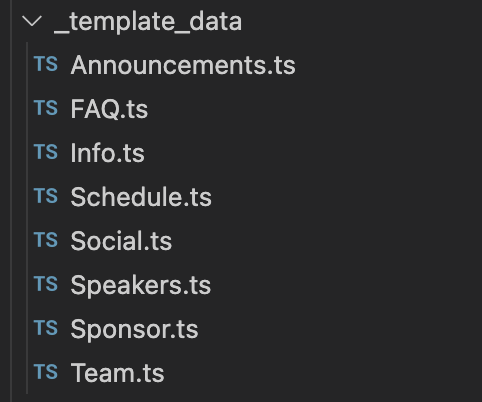

All the template data can be customized and found in the following files. 

## 📦 Setting up Airtable

1. Sign into [Airtable](https://airtable.com/).
2. Click on the "Create a base" button on the bottom left corner of the screen.
3. In your new Untitled base you can modify the name to be something like "Hackathon Base" and the table name to be something like "Hackers." With the left navigation pane we can select to create a form! 


### Airtable Environment Variables

1. We can find our Airtable base by navigating to the [Airtable API reference](https://airtable.com/developers/web/api/introduction) and selecting the base we created. In the documentation you will discover your base. 

 

<br/>

2. Make sure that your form contains an Email field in order to populate the Airtable. Also make sure to add an Accepted (checkbox) field in your Grid View (do not reveal the checkbox in the form). Example below: 

 

<br/>

3. We can create a [personal access token](https://airtable.com/create/tokens/new) for our Airtable with the following permissions with our Hacker Base selected. 


<br />

4. Finally, we need to show our form as well! Click on the Share Form button, click on Embed this view, copy the src as highlighted, and that will be our ```AIRTABLE_FORM_EMBED``` environment variable. 


<br/>

In the example above, our environment variables would be the following:
```
AIRTABLE_PERSONAL_ACCESS_TOKEN="<YOUR_PERSONAL_ACCESS_TOKEN>"
AIRTABLE_BASE="apprLCAaZ2OuX7L0Q"
AIRTABLE_TABLE_NAME="Hackers"
AIRTABLE_FORM_EMBED="<YOUR_AIRTABLE_FORM_SHARE_LINK>"
```

## 👨‍🍳 Gallery

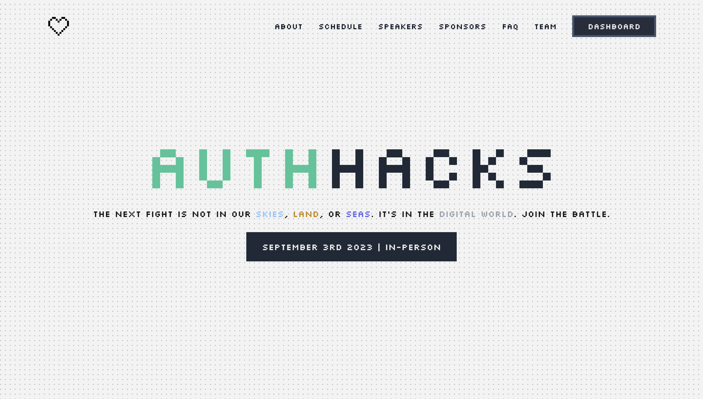
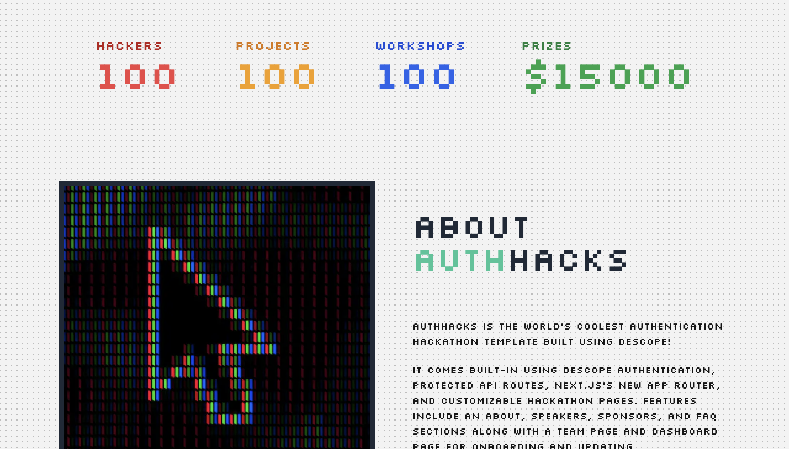
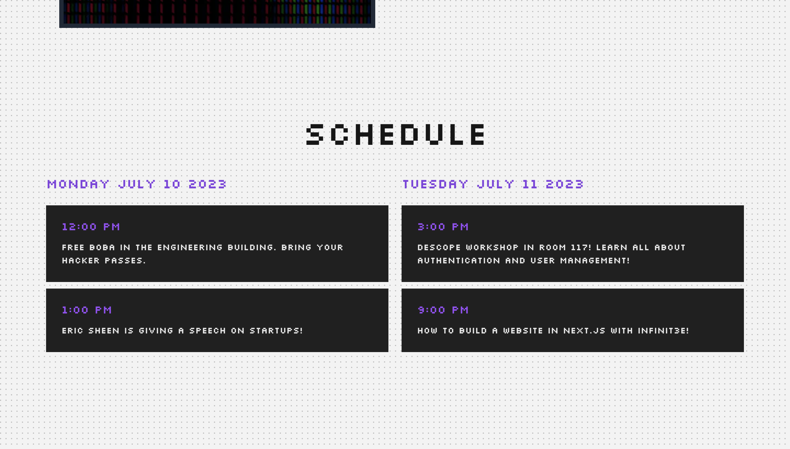

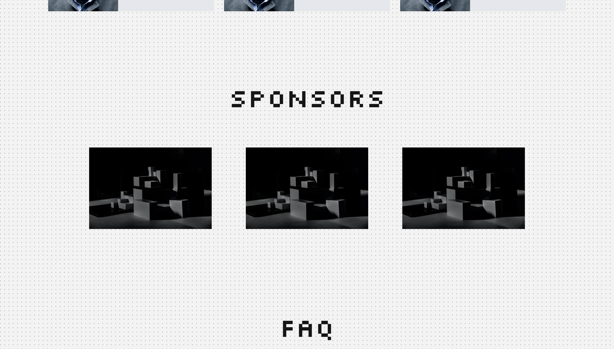
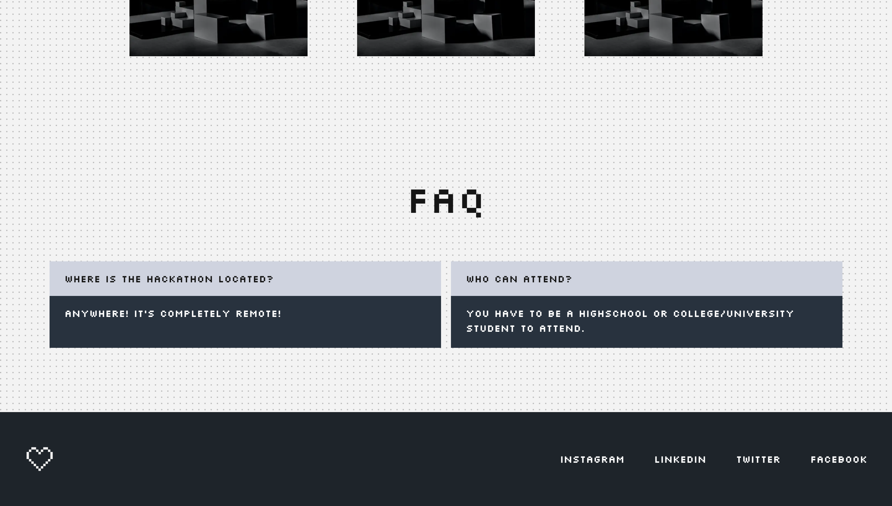
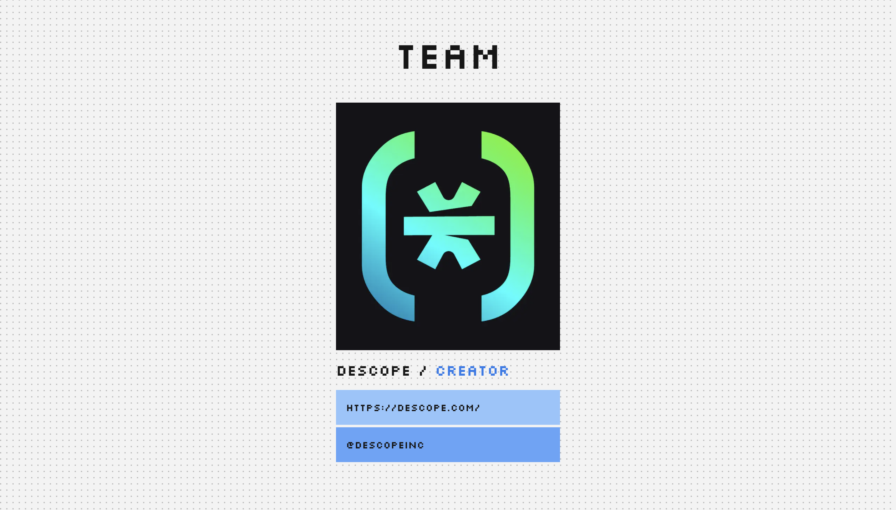
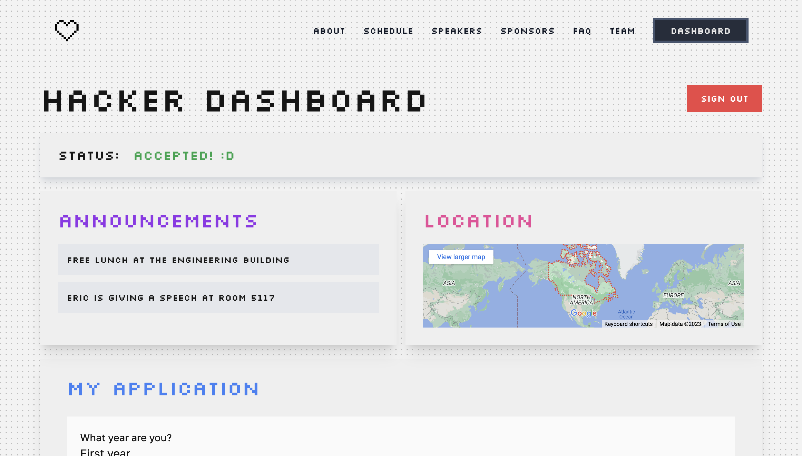
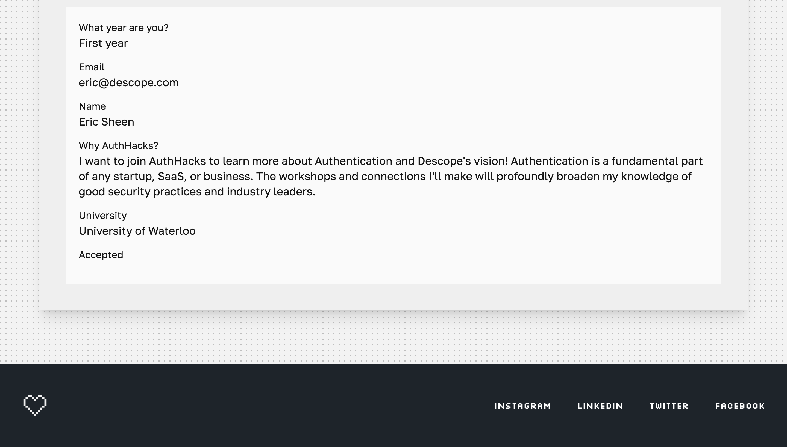
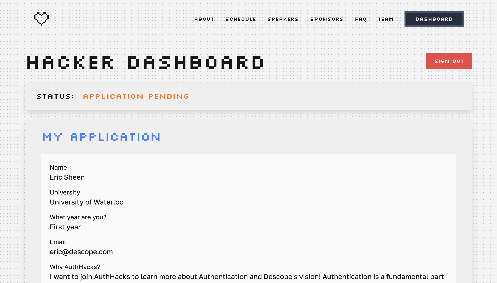
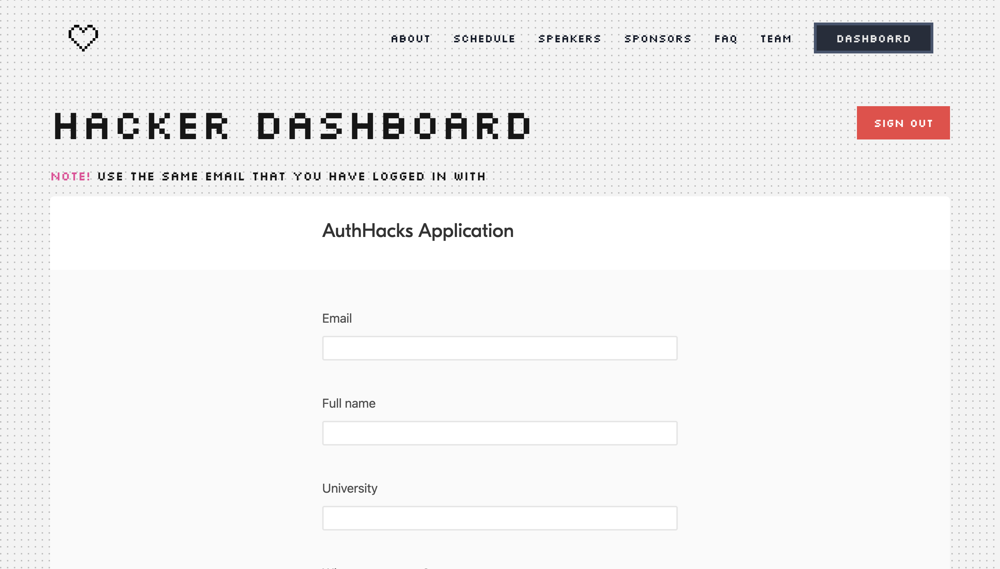

<br />
<br />

## Made with ☕ + 💙